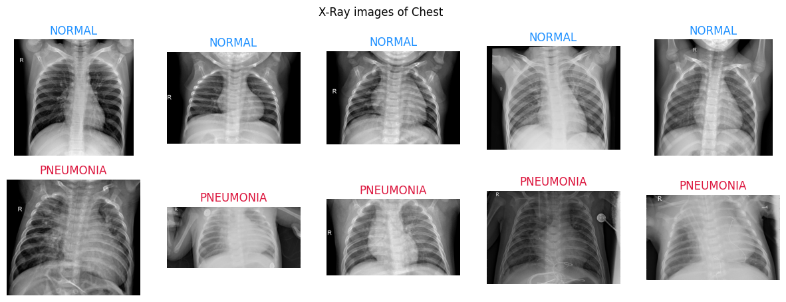
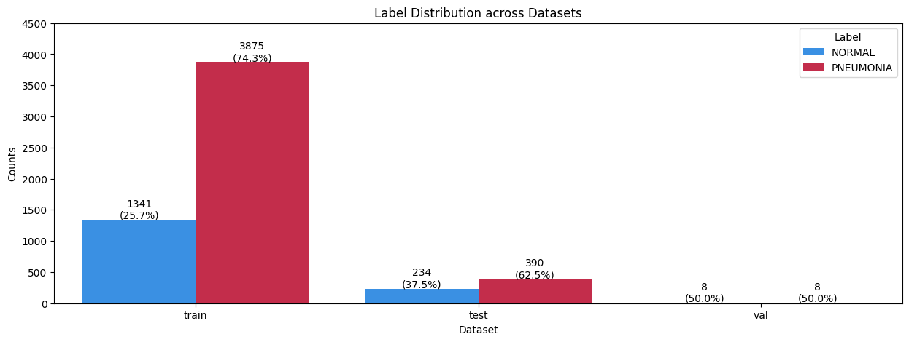
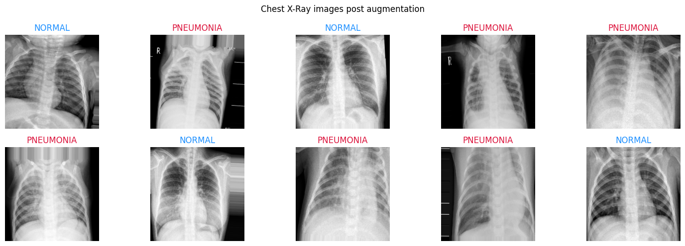
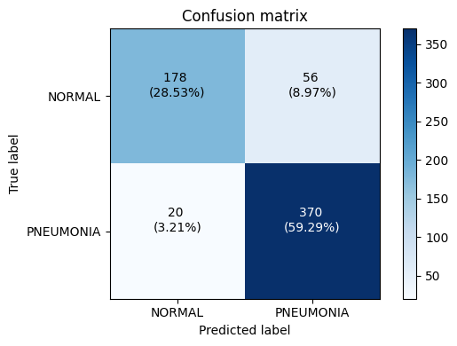
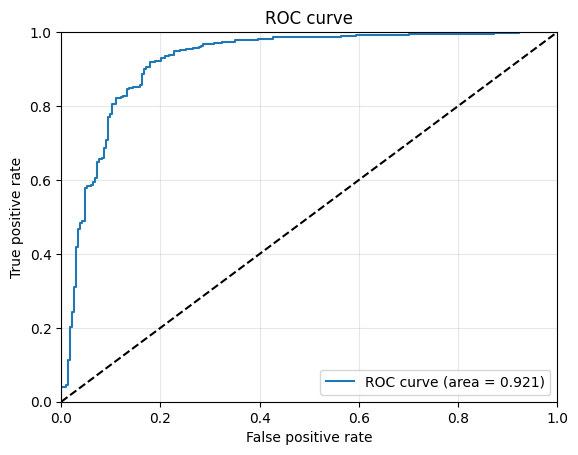
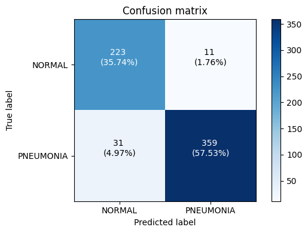
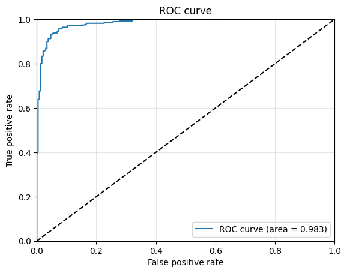
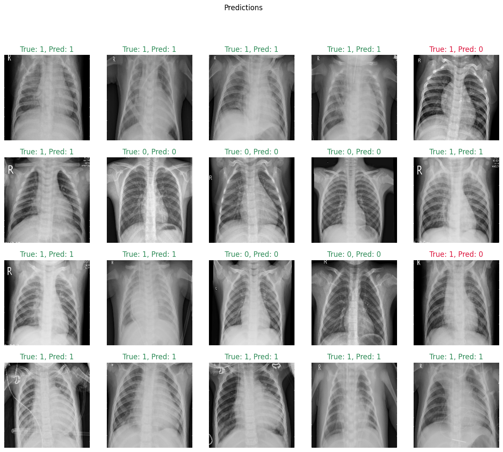

# Pneumonia classification from chest X-ray images with Convolutional Neural Networks and Inception-V3

Pneumonia is one of the most fatal diseases caused in the lungs. The diagnosis involves a chest x-ray which is interpreted by a radiologist. Human assisted diagnosis has its own limitations like the availability of an expert, cost, etc and hence an automated method for the detection of pneumonia from x-rays is a necessity.

**Goal:** Detection of pneumonia by the use of X-ray images → Binary classification into 2 classes: NORMAL and PNEUMONIA.

## Dataset

- Dataset: https://www.kaggle.com/paultimothymooney/chest-xray-pneumonia
- Original source: http://www.cell.com/cell/fulltext/S0092-8674(18)30154-5

### Details:

- Training: 5216 images; NORMAL/PNEUMONIA ratio is 1:3
- Validation: 16 images; NORMAL/PNEUMONIA ratio is 1:1
- Test: 624 images; NORMAL/PNEUMONIA ratio is around 1:1.7

### Solutions:

- **Stratified Splitting:** The training data needs to stratified into training and validaiton sets (80/20) and the ratio of classes should be kept equal in each dataset to achieve consistent prediction performance scores.
- **Add class weights:** Assign higher weights to minority classes during model training to make the model more sensitive to these classes.
- **Evaluation Metrics:** Use evaluation metrics that are robust to class imbalance, such as precision, recall, F1-score, or area under the ROC curve (AUC-ROC).

## Preprocessing and Augmentation

- The original images are recorded in different dimensions. Therefore, the X-ray images are resized to a standard size: 224x224.
- Data augmentation: Augmentations like random rotation, zooming, or shifting are applied to introduce variations in the training data. However, I didn't apply transformations such as flips and big rotations because X-ray scans are only taken in a specific orientation and this variations don't exist in real X-ray images

## Convolution Neural Network

Initially, I developed a CNN model from scratch. To define the optimal architecture, I tested different configurations and consulted relevant research papers to guide the design process.

### Results:

- Accuracy: 0.8782
- Precision: 0.8685
- Recall: 0.9487
- F1-Score: 0.9069
- AUC-ROC: 0.921

Despite the relatively good performance, there was room for improvement, particularly in terms of accuracy and precision.

The high recall suggests that the model is adept at capturing almost all instances of pneumonia, minimizing false negatives (pneumonia cases incorrectly classified as normal). However, the precision being slightly lower indicates that there are some false positives (normal cases incorrectly classified as pneumonia).

This trade-off needs careful consideration in medical applications, where the cost of false positives and false negatives can have significant implications.

## Transfer learning with CNNs

To improve the performance of the model, I employed transfer learning using the InceptionV3 network, which is a pre-trained model known for its high accuracy in image classification tasks.

The key reasons for this choice were:

- Enhanced Performance: It is designed to handle a variety of visual features, making them suitable for complex image classification tasks.
- Reduced Training Time: Transfer learning allows for faster convergence as it utilizes pre-trained weights from large datasets.
- Improved Generalization: The pre-trained model has already learned robust feature representations, which helps in better generalization on the target dataset.

### Results:

The transfer learning approach with Inception improved the model's performance metrics:

- Accuracy: 0.9327
- Precision: 0.9703
- Recall: 0.9205
- F1-Score: 0.9447
- AUC-ROC: 0.983

An important observation is that precision increased while recall slightly decreased with the Inception model. This indicates that while the model became more precise in identifying pneumonia cases (higher precision), it also missed more actual pneumonia cases (lower recall).

## Conclusion and discussion

This project demonstrates the effectiveness of using CNNs and transfer learning for the classification of pneumonia from X-ray images. Starting with a CNN from scratch provided a solid foundation, while transfer learning with the Inception network significantly improved the classification performance.

### Key Points

- Imbalanced data: Used class weights to handle the imbalance, improving model accuracy.
- Data Augmentation: Applied to create variability and enhance model robustness.
- Evaluation metrics: Computed accuracy, precision, recall, and F1-score for a comprehensive performance assessment.
- Computational constraints: Simpler CNN architectures were used initially due to hardware limitations.

### Future Work

- Advanced data augmentation: Explore more techniques to further improve robustness.
- Ensemble methods: Combine multiple models for enhanced performance.
- Hyperparameter tuning: Optimize model parameters for better results.
- Clinical testing: Evaluate the model in real-world medical settings.
- Complex architectures: Utilize more advanced architectures with better hardware.
- Precision/Recall improvement: Focus on increasing precision without reducing recall, and vice-versa.

This project underscores the importance of leveraging advanced machine learning techniques and methodologies to improve medical image classification, ultimately contributing to better healthcare outcomes.

Thank you for your interest and support. Your feedback is highly appreciated and will help guide future improvements :)
